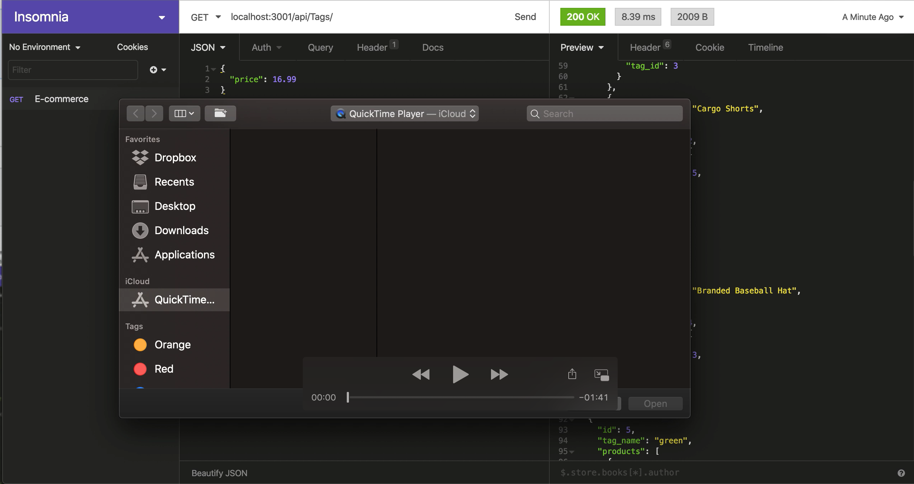

# E-commerce Back-End

Basic back end for an e-commerce site.

# User Story

AS A manager at an internet retail company
I WANT a back end for my e-commerce website that uses the latest technologies
SO THAT my company can compete with other e-commerce companies

# Installation

In your command line:

1. `npm install`
2. `mysql -u root -p`
3. Enter your password
4. `source db/schema.sql`
5. `exit;`
6. `npm run seed`
7. `npm start`

# How it works

See below is the video showcasing the functionality of the E-commerce application:

https://youtu.be/FKtlyfBOZ9I

# Languages

* Vanilla JS
* Express
* Sequelize
* MySQL
* Dontenv

# Author

Rochelle Ruiz

# Challenges

Some challenges that I encountered in this weekly challenge is the modularized aspect which turned a my work into a success. It is pretty simple if you look at it from a far. Sequelize made it very simple compare it to dealing with ONLY MySQL. The challenging part of it is the modularized version of what we have been doing. It is getting used to knowing what folder does the file belongs to and properly syncing it to another file. From last week's challenge, I had a hard time connecting to my database which now became so easy for me. I believe doing something repeatedly makes your learn and get used to the flow. With this week, it is getting used to the modularized version of making an application. All in all, I got to make all my routes work. It does GET, DELETE, PUT and POST.
